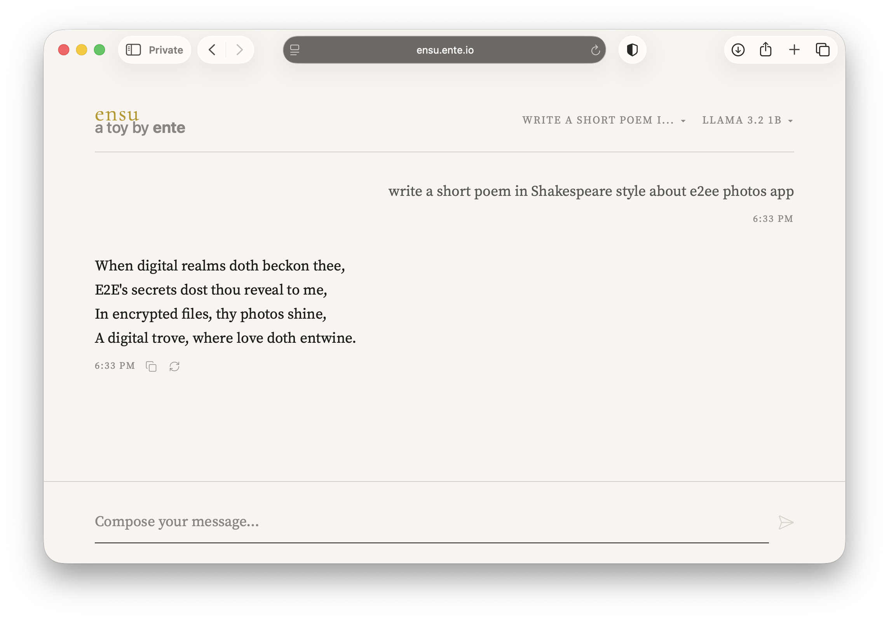

# ensu

Run LLMs locally in your browser, privately, on-device. No server required.



## Features

- 🧠 **Local LLM** - Run models directly in the browser via WebGPU
- 🌐 **Static Deployment** - Works on GitHub Pages, no backend needed
- 🔌 **OpenAI Compatible** - Connect to any OpenAI-compatible API (local or remote)
- 💬 **Session Management** - Chat sessions saved in browser (localStorage)
- 🎨 **Modern UI** - Clean web interface with streaming responses
- ⚡ **Streaming** - Real-time token streaming
- 🔒 **Private** - Everything runs in your browser, no data sent to servers

## Deployment

### GitHub Pages (Recommended)

1. Copy `interfaces/web/public/` to your repo
2. Enable GitHub Pages in repo settings
3. Done! Visit `https://yourusername.github.io/repo-name`

### Local Development

```bash
npm install
npm start
```

Open http://localhost:3000

## Architecture

```
interfaces/web/public/         # Static frontend (deploy this!)
├── index.html                 # Main HTML
├── app.js                     # Application logic
├── local-llm.js               # WebGPU LLM client (MLC)
└── styles.css                 # Styles
```

## Providers

- **local** - Browser-based inference via WebGPU (MLC LLM)
- **remote** - OpenAI-compatible APIs (including local Ollama with `http://localhost:11434/v1`)

## Supported Models

### Local (Browser-based, WebGPU)

| Model | Parameters | VRAM | Context |
|-------|------------|------|---------|
| Ministral 3B | 3B | ~2GB | 128K |
| Llama 3.2 1B | 1B | ~879MB | 4K |

*Models run entirely in your browser using WebGPU. First load downloads the model, subsequent loads use IndexedDB cache.*

### Remote (OpenAI-compatible)

Connect to any OpenAI-compatible API:
- **Local Ollama**: `http://localhost:11434/v1`
- **OpenAI**: `https://api.openai.com/v1`
- **Any compatible API**: Configure via settings

## Configuration

Models are configured in `app.js` under `EMBEDDED_CONFIG`. To add custom models:

1. Edit the `EMBEDDED_CONFIG` object in `interfaces/web/public/app.js`
2. Or use the Settings UI to add remote models

### Adding Local Models

Find MLC-compatible models at: https://huggingface.co/mlc-ai

```js
{
  id: 'your-model-id',
  name: 'Display Name',
  parameters: '3B',
  context: 4096,
  vramRequired: 2000,  // MB
  modelUrl: 'https://huggingface.co/...',
  modelLib: 'https://huggingface.co/.../model.wasm',
}
```

## Browser Requirements (Local LLM)

For browser-based inference, you need:
- **WebGPU support**: Chrome 113+, Edge 113+, or Firefox Nightly
- **Sufficient VRAM**: Check model requirements (e.g., 2GB for Ministral 3B)
- **Models cached in IndexedDB** for faster subsequent loads

## License

MIT
